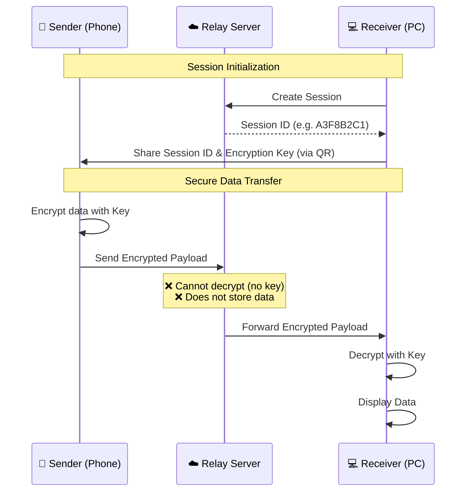

<div align="center">
  
# 🪶 Ledger

**Encrypted. Instant. No install.**  
*Move clipboard content, links, and files between your phone and PC in seconds.*

[](https://opensource.org/licenses/MIT)
[](https://nodejs.org/)
[](https://nextjs.org/)
[](https://react.dev/)

[Features](#-features) • [How it Works](#-how-it-works) • [Architecture](#-zero-knowledge-architecture) • [Getting Started](#-getting-started)

</div>

---

## 📖 What is Ledger?

Ledger is a **cross-device data transfer tool** built for the modern web. It allows you to seamlessly beam text, links, and files between any two devices (e.g., your laptop and your phone) using just a web browser. 

No apps to download. No accounts required on the receiving end. 

### Why Ledger?
Most file transfer apps require you to install an app on both devices, create accounts, or deal with platform lock-in (like AirDrop). Ledger works everywhere, instantly, and secures your data with ephemeral sessions and a zero-knowledge relay architecture.

---

## ✨ Features

- 🔒 **End-to-end Encrypted**: 256-bit AES encryption keys are generated per session.
- 🚫 **Zero-Knowledge Relay**: The server only forwards sealed payloads. It literally cannot read your data.
- ⚡ **Instant & Ephemeral**: Sessions are temporary and auto-expire. No data is stored persistently.
- 📱 **Cross-Platform**: Works on iOS, Android, Windows, macOS, Linux — anything with a web browser.
- 🎨 **Beautiful UI**: Designed with a custom "Fig Mint" aesthetic (parchment & ink) for a premium feel.

---

## 🛠️ How it Works

Transferring data takes just a few seconds:

1. **Cut a new key**: Open Ledger on your PC (or Device 1). A unique session code and QR code are generated.
2. **Insert the key**: On your phone (Device 2), scan the QR code or enter the session ID. The devices pair securely.
3. **Turn the lock**: Send text, copy clipboard data, or upload files. They appear instantly on the other device.

---

## 🏗️ Zero-Knowledge Architecture

Ledger was engineered from the ground up for privacy. Data is encrypted on the sender's device and decrypted only on the receiver's device. 



---

## 🚀 Getting Started (For Developers)

Want to run Ledger locally or contribute? Follow these steps:

### Prerequisites
- Node.js (v18 or higher)
- MongoDB (running locally or a free MongoDB Atlas cluster)

### 1. Clone the Repository
```bash
git clone https://github.com/yourusername/ledger.git
cd ledger
```

### 2. Backend Setup
```bash
cd backend
npm install
```
Create a `.env` file in the `backend` directory:
```env
PORT=8000
MONGODB_URI=mongodb://localhost:27017/ledger
JWT_SECRET=your_super_secret_jwt_key
SERVER_URL=http://localhost:8000
```
Start the backend server:
```bash
npm run dev
```

### 3. Frontend Setup
Open a new terminal and navigate to the frontend:
```bash
cd frontend
npm install
```
Create a `.env` file in the `frontend` directory:
```env
NEXT_PUBLIC_BACKEND_URL=http://localhost:8000
NEXT_PUBLIC_APP_URL=http://localhost:3000
```
Start the frontend development server:
```bash
npm run dev
```

### 4. Open the App
Visit `http://localhost:3000` in your browser.

> **Pro Tip for Local Testing:** To test phone-to-PC transfers on your local Wi-Fi, change `localhost` in your frontend `.env` to your computer's local IP address (e.g., `192.168.1.5`), restart the frontend server, and access it from your phone.

---

## 💻 Tech Stack

**Frontend:**
- [Next.js](https://nextjs.org/) (App Router)
- React 19
- Tailwind CSS (Custom "Fig Mint" Design System)
- Shadcn UI (Customized Primitives)
- Socket.io-client

**Backend:**
- Node.js & Express
- Socket.io (Real-time signaling)
- MongoDB / Mongoose
- Multer (File handling)

---

## 🤝 Contributing

Contributions make the open source community such an amazing place to learn, inspire, and create. Any contributions you make are **greatly appreciated**.

1. Fork the Project
2. Create your Feature Branch (`git checkout -b feature/AmazingFeature`)
3. Commit your Changes (`git commit -m 'Add some AmazingFeature'`)
4. Push to the Branch (`git push origin feature/AmazingFeature`)
5. Open a Pull Request

---

## 📄 License

Distributed under the MIT License. See `LICENSE` for more information.

---

<div align="center">
  <p>Engineered with precision. Open source and independent.</p>
</div>
